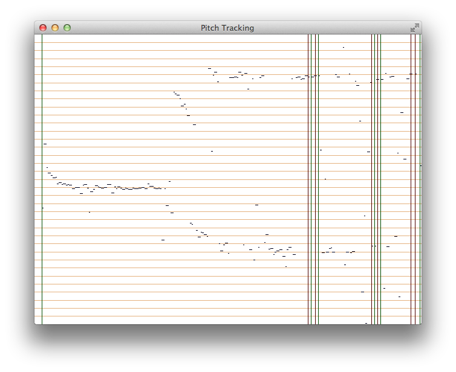

# Dubstep DSP



## Dependencies
Install [Homebrew](http://brew.sh) if you haven't already. Then:
```
# Install CMake (needed to build GLFW)
brew install cmake

# Install FFTW
brew install fftw

# Install GLFW
curl https://codeload.github.com/glfw/glfw/zip/3.0.4 -o glfw-3.0.4.zip
unzip glfw-3.0.4.zip
cd glfw-3.0.4
cmake .
make
make install # MAY NEED SUDO

# Install libsndfile
brew install libsndfile

# Install PortAudio
brew install portaudio

# Install PortMidi
brew install portmidi
```

- **FFTW:** http://www.fftw.org
- **GLFW:** http://www.glfw.org
- **libsndfile:** http://www.mega-nerd.com/libsndfile
- **PortAudio:** http://www.portaudio.com
- **PortMidi:** http://portmedia.sourceforge.net/portmidi

## Running

First install and start a MIDI synthesizer (like [SimpleSynth](http://notahat.com/simplesynth/)). Then:
```
make
```

## Components

### Lib
- [Glove](glove.h) - Glove communication.
- [GUI](gui.h) - Graphical user interface.
- [Live](live.h) - Live analysis backend.
- [Midi](midi.h) - MIDI output.
- [Pitch](pitch.h) - Pitch detection algorithms.

### Bin
- [Main](main.c) - Live pitch detection, visualization and MIDI output.
- `*_test` - Various component tests.

## Todo

- Move onset / offset detection into [live.c](live.c).
